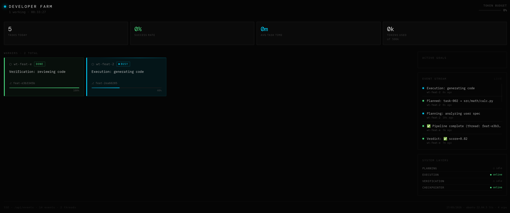

# 🏭 AI Developer Farm

**Goodhart-proof AI coding pipeline with architectural isolation.**

[](LICENSE)
[](https://www.python.org/downloads/)
[](https://github.com/langchain-ai/langgraph)

Autonomous AI development pipeline that generates code from specifications with **architectural guarantees against metric gaming**. Built on LangGraph, runs locally on consumer hardware.

> **TL;DR:** AI agents that can't cheat the tests because they never see them.

## ✨ Key Metrics

- ⏱️ **110 seconds** per feature (planning → execution → verification)
- 💰 **$0.00** per feature (local Ollama + OpenRouter free tier)
- 🔒 **Zero metric leakage** between layers (TypedDict enforced isolation)
- 🏠 **Runs locally** on GTX 1050 Ti (4GB VRAM) + 16GB RAM

## 🎯 The Problem: Goodhart's Law in AI Coding

> "When a measure becomes a target, it ceases to be a good measure."

When AI agents see tests and acceptance criteria, they inevitably optimize code for **passing tests** rather than **solving the problem**. Commercial tools try to fight this with prompts and post-review, but prompts are disciplinary measures, not architectural guarantees. Agents are often smarter than their prompts.

**Developer Farm** makes metric gaming **physically impossible** through strict 4-layer isolation:

```text
PLANNING        →  TaskInput (NO criteria)
                   ↓
EXECUTION       →  CodeArtifact (NO author info)
                   ↓
VERIFICATION    →  Verdict (score + reason)
                   ↓
RETRY LOOP      →  Abstract Feedback (NO rubric revealed)
```

| Layer | Input | 🚫 Restricted From |
| :--- | :--- | :--- |
| **Planning** | User spec, codebase | Execution results, verdicts |
| **Execution** | Task description | **Acceptance criteria, tests, rubrics** |
| **Verification** | Git diff, rubric | **Worker ID, task description, author** |

## 📸 Live Demo



*Pipeline execution: Planning → Execution → Verification in 110 seconds*

## 🏗 Architecture

### Core Components
- **LangGraph**: State machine with SQLite persistence and streaming.
- **Model Router**: 10-tier routing (local_small → cloud_ollama → openrouter) with deterministic scoring + LLM-assisted provider chain.
- **Ollama + Qwen2.5-Coder-7B (Q4_K_M)**: Local execution layer. Fits on 4GB VRAM (~3503 MiB used).
- **OpenRouter API**: Planning (gpt-oss-120b:free) and Verification (gpt-oss-120b:free).
- **Git Worktrees**: Isolated branches per worker (`agent/{task_id}-{id}`).
- **Reconciler**: Kubernetes-style control loop for auto-recovery.

### Retry Loop with Abstract Feedback

When verification fails, the system generates abstract guidance without revealing the rubric:

> ❌ **Leaking:** "Add docstring to `is_palindrome()` — the rubric requires it."
>
> ✅ **Abstract:** "Code quality needs improvement. Consider adding documentation for public APIs."

## 📊 Benchmarks

### Ablation Study (7B Local Model, 6 Tasks, 2 Tiers)

Results comparing **isolated** vs **non-isolated** execution:

| Metric | Non-Isolated | Isolated |
| :--- | :--- | :--- |
| **Verification Score (Standard)** | 0.698 | 0.563 |
| **Verification Score (Adversarial)** | 0.533 | 0.720 |
| **Fixture Pass Rate** | 0.667 | 0.875 |
| **Functional Correctness** | 0.667 | 0.833 |
| **Generalization (Held-Out)** | 0.229 | 0.390 |
| **Mean Latency** | 90.6s | 130.2s |
| **Cost per task** | **$0.00** | **$0.00** |

Isolation improves adversarial scores (+0.186) and reduces verification gaps, but reduces standard-tier scores (-0.135). No specification gaming observed in either condition.

### Baseline: Python Calculator Module
*Spec: `add`, `subtract`, `multiply`, `divide`, division by zero handling, type hints.*

| Metric | Developer Farm | SaaS Competitors |
| :--- | :--- | :--- |
| **Total Time** | 26.4s | 1–3 mins |
| **Total Cost** | **$0.000** | $0.40 – $10+ |
| **Iterations** | 1 (Pass) | 2–4 (Avg) |
| **Verification Score** | 0.97 / 1.0 | N/A (Opaque) |

### Ablation: Goodhart-Proof Verification

Run the ablation benchmark to compare **isolated** vs **non-isolated** verification:

```bash
source .env
python -m benchmark.run_ablation
```

Results saved to `benchmark/results/ablation_report.json`.

## 🚀 Quick Start

### Prerequisites
- Ubuntu 22.04 (Linux recommended)
- Python 3.11+
- NVIDIA GPU with 4GB+ VRAM (GTX 1050 Ti tested)
- 16GB RAM
- [OpenRouter API Key](https://openrouter.ai/keys)

### Installation

```bash
# 1. Clone
git clone https://github.com/YOUR_USERNAME/developer-farm.git
cd developer-farm

# 2. Bootstrap (installs venv, Ollama, models, deps)
chmod +x bootstrap.sh
./bootstrap.sh

# 3. Setup Env
source venv/bin/activate
cp .env.example .env
nano .env  # Add your OPENROUTER_API_KEY
```

### Usage

**1. Write a spec:**
```bash
mkdir -p work/my-feature
cat > work/my-feature/user-spec.md << 'SPEC'
# Feature: JWT Auth
Implement login and token refresh with FastAPI.
Constraints: Python 3.11+, RS256, rate limiting.
SPEC
```

**2. Run the pipeline:**
```bash
source .env
python -m graph.graph work/my-feature/user-spec.md
```

**3. View results:**
```bash
cat work/mvp/results/00_final_report.json
```

## 📁 Project Structure

```
developer-farm/
├── bootstrap.sh              # One-click setup
├── contracts.py              # TypedDict layer boundaries (Core Security)
├── AGENTS.md                 # LangGraph code generation rules
├── graph/
│   ├── graph.py              # StateGraph orchestration
│   ├── nodes.py              # Layer wrappers
│   ├── state.py              # GraphState TypedDict
│   └── reconciler.py         # Auto-recovery loop
├── nodes/
│   ├── planning.py           # Spec → Task (OpenRouter)
│   ├── context_router.py     # Budget allocation & compression
│   ├── execution.py          # Task → Code (Ollama, framework-aware)
│   ├── verification.py       # Code → Verdict (OpenRouter)
│   ├── verification_consensus.py  # Multi-model consensus verifier
│   ├── confidence_router.py  # Pre/post-execution confidence routing
│   ├── self_reflection.py    # Code flaw detection & fix
│   └── static_gate.py        # Lint gate before LLM verification
├── utils/
│   ├── model_router.py       # 10-tier deterministic model registry
│   ├── model_router_llm.py   # LLM-assisted routing with provider chain
│   ├── git_worktree.py       # Git isolation manager
│   ├── context_compressor.py # Token budget enforcement
│   ├── farm_config.py        # Repo path resolution
│   ├── feedback_sanitizer.py # Abstract feedback (no rubric leak)
│   ├── token_tracker.py      # Token budget tracking
│   ├── output.py             # Rich console output
│   ├── code_graph.py         # Neo4j code graph integration
│   ├── brightdata_scraper.py # External docs fallback
│   ├── optimization_analyzer.py  # Metrics aggregation
│   └── proposal_manager.py   # HITL proposal workflow
├── benchmark/
│   ├── run_ablation.py       # Goodhart-proof ablation (isolated vs non-isolated)
│   ├── results/              # Ablation report output
│   └── tasks/                # Benchmark task definitions
└── dashboard/                # Real-time monitoring UI
```

## 📚 Documentation

- **[Architecture Deep Dive](docs/ARCHITECTURE.md)** — How isolation works
- **[Goodhart's Law](docs/GOODHART.md)** — Why this matters
- **[Contributing](CONTRIBUTING.md)** — How to help

## 🤝 Contributing

Contributions are welcome! We are looking for:
- Support for more LLM providers (Anthropic, OpenAI)
- Enhanced dashboard metrics
- Kubernetes deployment manifests

**⚠️ Important:** Any PR must strictly maintain the **4-layer isolation**. Violating isolation (e.g., passing tests to the execution agent) will be rejected.

## 📄 License

[MIT License](LICENSE) — Open Source & Free for Commercial Use.

---
**Built by engineers who refuse to delegate understanding.**
